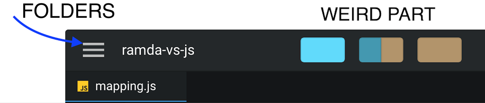
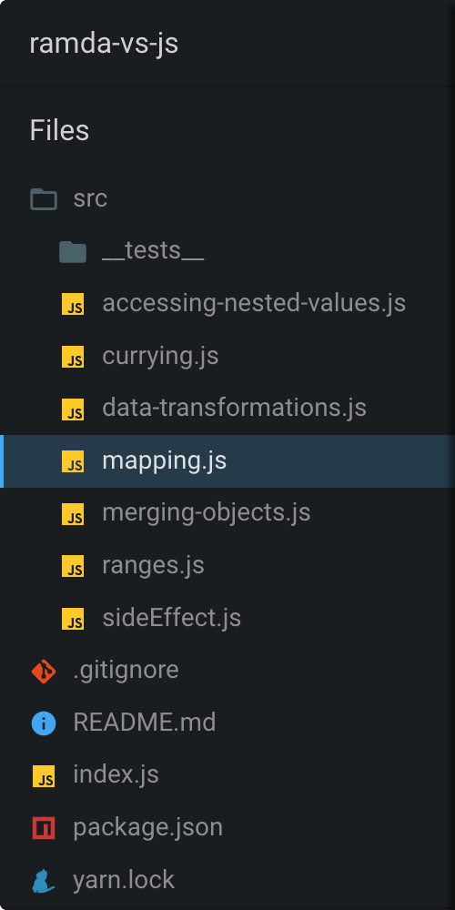
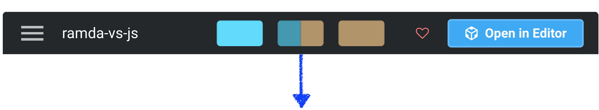
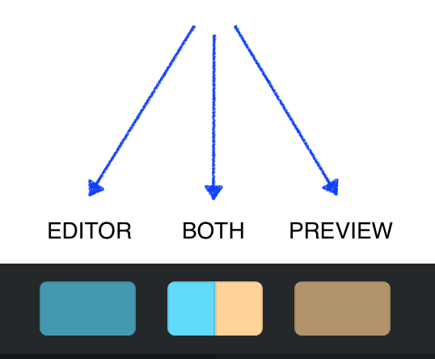
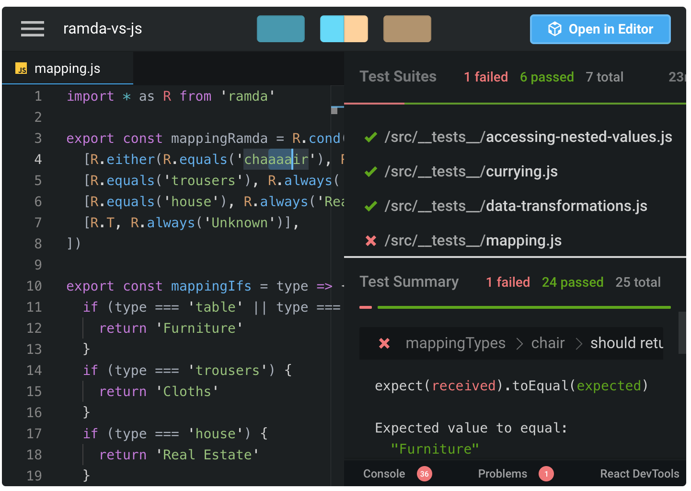
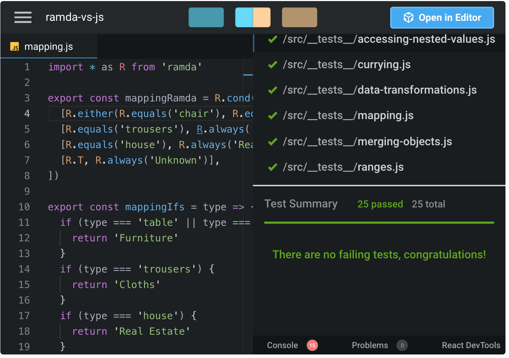
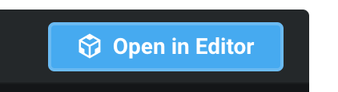
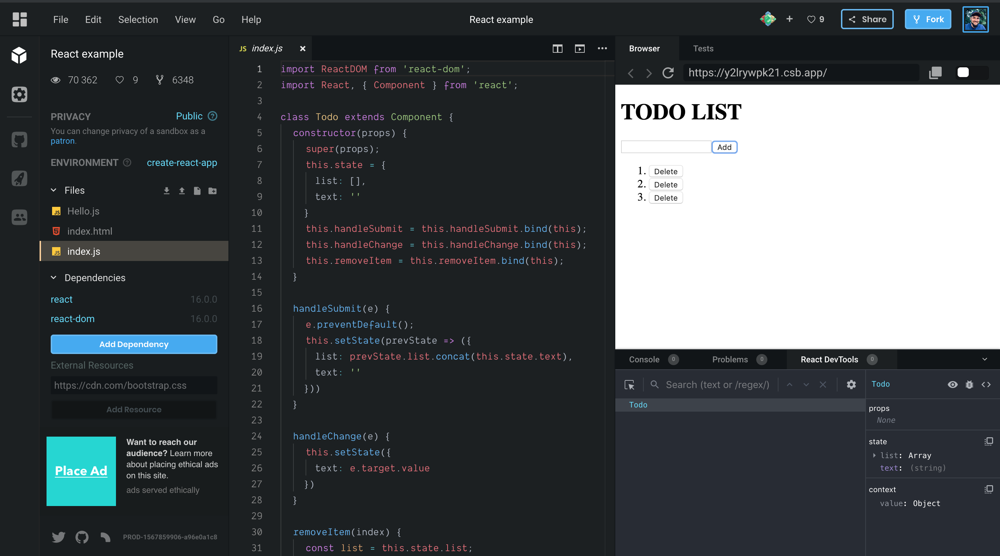

- **[Codesandbox](http://bwidlarz.com/codesandbox/#codesandbox)**
- **[Explorer](http://bwidlarz.com/codesandbox/#explorer)**
- **[Changing the view](http://bwidlarz.com/codesandbox/#changing-the-view)**
- **[Open in Editor](http://bwidlarz.com/codesandbox/#open-in-editor)**

### CodeSandbox

This is a code sandbox:

<iframe 
    src="https://codesandbox.io/embed/github/Okelm/ramda-vs-vanilla-js/tree/master/?autoresize=1&fontsize=14&module=%2Fsrc%2Fmapping.js&moduleview=1&previewwindow=tests&view=editor" 
    title="ramda-vs-js" 
    allow="geolocation; microphone; camera; midi; vr; accelerometer; gyroscope; payment; ambient-light-sensor; encrypted-media; usb" 
    style="width:100%; height:500px; border:0; border-radius: 4px; overflow:hidden;" 
    sandbox="allow-modals allow-forms allow-popups allow-scripts allow-same-origin">
</iframe>

CodeSandbox is an online code editor, more info can be found here in its [docs](https://codesandbox.io/docs/#what-is-codesandbox).
### Explorer

Click the hamburger menu to see the folder structure:

This should look familiar:

### Changing the view

This tool is amazing, yet IMO this is the most confusing part of the CodeSandbox UI. It wasn't obvious to me what it does until I clicked it:

- **Editor** is what you have already seen. You edit code there,
- **Preview** depends on the sandbox setting and can be a browser with rendered output or tests’ results. In this case we edit functions with unit tests, so clicking **Preview** runs tests and shows the results,
- **Editor/Preview** the screen splits to show both options.

Go to the [sandbox](http://bwidlarz.com/link) and play with the view options: 

Once you change something in the code, the code is rerun after each keystroke.

### Open in Editor

Clicking this:

Moves you straight to the web app which gives you a full set of options:

Most of them are available from the embedded version too though.

Now that you know the basics you can go and utilize embedded sandboxes in every blog post and documentation!