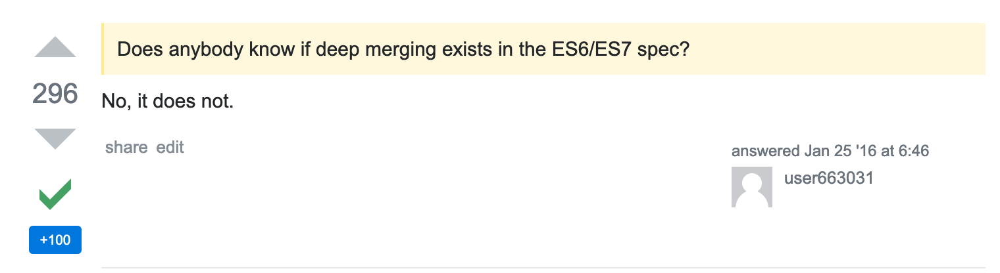

- **[Introduction](http://bwidlarz.com/react-vs-react-native/#moving-between-react---react-native-back-and-forth)**
- **[Safely accessing deeply nested values](https://bwidlarz.com/react-vs-react-native/#differences-in-code)**
- **[Data transformations](https://bwidlarz.com/react-vs-react-native/#differences-in-code)**
- **[Conditionals](https://bwidlarz.com/react-vs-react-native/#differences-in-code)**
- **[Merging objects](https://bwidlarz.com/react-vs-react-native/#other-differences)**
- **[Ranges generation](https://bwidlarz.com/react-vs-react-native/#so-maybe-react-native-web)**
- **[Handling side effects while staying functional](https://bwidlarz.com/react-vs-react-native/#so-maybe-react-native-web)**
- **[Currying and partial application in one](https://bwidlarz.com/react-vs-react-native/#so-maybe-react-native-web)**
- **[Sump up](https://bwidlarz.com/react-vs-react-native/#so-maybe-react-native-web)**

This is a list of functions linked to the the section with usage: 
- [propOr](), [map](), [cond](), [either](), [equals](), [always](), [T](), [mergeDeepWith](), [concat](), [range](), [pipe](), [sum](), [tap](), [lt (lessThan)](), [curry]()

Please reach out to [documentation](https://ramdajs.com/docs/#) to read up on detailed explantion of each function.

### Introduction

My intention is to show some usage of Ramda library, and to better express what is happening with this concise functional code of Ramda, there are equivalent-ish implementations in Vanilla JS.

I'm not opting for using Ramda everywhere, just to be clear. I don't like how people are trying to be consistent and use one lib wherever they can. Instead, I prefer to produce a readable code consistently, with all the means necessary.

https://twitter.com/dabit3/status/1156932035501547520?s=20


I don't want to explain how functions work, neither judge which approach is better than other. I will rather show examples in context and compare to vanilia JS implementation if possible.

### Codesandbox

To support better reading experience you get access to the whole code from the article which you can change, fork and test - there are unit tests for each and every case:

<iframe 
  src="https://codesandbox.io/embed/github/Okelm/ramda-vs-vanilla-js/tree/master/?fontsize=14&hidenavigation=1&module=%2Fsrc%2Faccessing-nested-values.js&previewwindow=tests" 
  title="ramda-vs-js" 
  allow="geolocation; microphone; camera; midi; vr; accelerometer; gyroscope; payment; ambient-light-sensor; encrypted-media; usb" 
  style="width:100%; height:500px; border:0; border-radius: 4px; overflow:hidden;" 
  sandbox="allow-modals allow-forms allow-popups allow-scripts allow-same-origin">
</iframe>

### Safely accessing deeply nested values

It's always been tedious to reach the nested data in JS objects and everybody has been waiting for optional chaining for long time now and [happily we're getting there](https://github.com/tc39/proposal-optional-chaining).

I've first seen it in Kotlin while working on native Android apps, and it seems that the syntax will be similar:

```js
const includes = app?.data?.listOfItems?.includes("something")
```

Until then (or until you [use this](https://babeljs.io/docs/en/babel-plugin-proposal-optional-chaining)) you could either use one of the existing libraries or vanilia JS:

```js
const includesJS = obj => !!obj && 
    !!obj.data &&
    !!obj.data.listOfItems &&
    obj.data.listOfItems.includes('something')
```

```js
const includesRamda = obj => R.pathOr([], ['data', 'listOfItems'], obj).includes('something')

```

### Data transformation
Let's complicate the above example. Not only do we have to access nested object but also map results. 

It's not always that great so you don't have to do any data transformations before rendering, because fetched data fully match client's needs. Especially if you work with legacy code, or you have just been involved in rapid prototyping for a startup, your data scheme between how it looks on backend and what frontend needs will definitely vary.

Imagine you have an object which has a list of items that you want to map to something else, defaulted to empty array if something is missing:

```js
const favorites = {
  movies: [
    {
      name: 'The Shawshank Redemption',
      views: 264726342,
    },
    {
      name: 'The Godfather',
      views: 264726343,
    },
  ],
  otherProps: {},
}
```

You're using untyped JS, but if it was Typescipt, types would tell you that data at all levels are optional:


```ts
interface Movie = {
  name: string,
  views: number,
}

interface Favorites = {
  movies?: Array<Movie>,
}

const enhanceFavoritesTs = (favs?: Favorites): EnhancedFavorites
```
And maybe if we were completely sure that none of our data are missing we could just do it in the following way:

```ts
export const enhanceFavoritesTs = (favs: Favorites): EnhancedFavorites =>
  favs.movies.map(({ name, views }) => ({
    name,
    views,
    value: `${name} has been viewed ${views}`,
  }))

```
But instead, we don't know anything about types and we have to assume that it can crash at any time during accessing to nested values. And here are just 3 examples of how this case can be handled:

You can start by implementing a solution with a ternary operator, but you will quickly notice that you will not pull it off without nesting a ternary operator to ensure you won't reaching undefined value of favs or movies:

```js
export const enhanceFavoritesTernary = favs =>
  favs
    ? favs.movies
      ? favs.movies.map(({ name, views }) => ({
          name,
          views,
          value: `${name} has been viewed ${views}`,
        }))
      : []
    : []
```

You decide to ditch ternany operator by following your gut feeling, or strict enough configuration of linter, or maybe your coleague's advice during code review... anyways, now you use a bunch of if-else statements:

```js
export const enhanceFavoritesIfs = favs => {
  if (favs) {
    if (favs.movies) {
      return favs.movies.map(({ name, views }) => ({
        name,
        views,
        value: `${name} has been viewed ${views}`,
      }))
    } else {
      return []
    }
  } else {
    return []
  }
}
```

You are new to the codebase, just joined the project and didn't know that there is already Ramda onboard, why not give it a try?
This is the implementation with Ramda.js:

```js
export const enhanceFavoritesRamda = R.pipe(
  R.propOr([], 'movies'),
  R.map(({ name, views }) => ({
    name,
    views,
    value: `${name} has been viewed ${views}`,
  })),
)
```

It differs very much from vanilia JS implementations. Where is even a fat arrow? Where is a parameter? Well, it's created by R.pipe behind the scene. The function takes implicitly whatever you provide it with and pass along to the first function. It executes from left to right (or top-down in here), starting by accessing movies property and defaulting to empty array if needed, and then mapping to what we need.

One thing can be notice there at this point - Ramda allows to easily compose functions. 

### Conditionals

You simply want to map one string to another, depending on what the string is. It might be that there are a business need to rename types of an entity, and there's no way that the change would be done on the backend side:

Implementation with if statements:

```js
export const mappingIfs = type => {
  if (type === 'table' || type === 'chair') {
    return 'Furniture'
  }
  if (type === 'trousers') {
    return 'Cloths'
  }
  if (type === 'house') {
    return 'Real Estate'
  }
  return 'Unknown'
}
```

Implementation with switch:

```js
export const mappingSwitch = type => {
  switch (type) {
    case 'table':
      return 'Furniture'
    case 'chair':
      return 'Furniture'
    case 'trousers':
      return 'Cloths'
    case 'house':
      return 'Real Estate'
    default:
      return 'Unknown'
  }
}
```

Implementation with Ramda's `cond` and `equals`, which encapsulates if/else statements:

```js
export const mappingRamda = R.cond([
  [R.either(R.equals('chair'), R.equals('table')), R.always('Furniture')],
  [R.equals('trousers'), R.always('Cloths')],
  [R.equals('house'), R.always('Real Estate')],
  [R.T, R.always('Unknown')],
])
```

### Merging objects

Imagine you have to update an object with some new properties. Like, let's say, you use Redux and you have pretty complex state object which stores various information about your app. It looks like this:



Well, we have to find another way to handle it.

```js
const state = {
  cart: {
    items: {
      variousItems: [
        {
          id: 1,
        },
      ],
      differentItems: [
        {
          id: 1,
        },
        {
          id: 2,
        },
      ],
    },
  },
}
```

And you want to update your state with:

```js{4-11}
const update = {
  cart: {
    differentItems: [
      {
        id: 2,
        total: 100,
      },
      {
        id: 3,
        total: 1000,
      },
    ],
  },
}
```

There is just one change here, two new items are added to one of the nested list.

Solution with vanilia JS:

```js
const output = {
  cart: {
    items: {
      variousItems: state.cart.items.variousItems,
      differentItems: [
        ...state.cart.items.differentItems,
        ...update.cart.items.differentItems,
      ],
    },
  },
}
```

Solution with Ramda:

```js
const output = R.mergeDeepWith(R.concat, state, update)
```

The problem with vanilia JS implementation is that it is narrowed only for that particular case. If we add another property to the update object, our implementation will have to be updated too.

What is a caveat for one case, it's an advantage for another. Ramda implemenation will execute deep merge for the whole object, whereas you may want to choose where to apply the change instead.

### Ranges generation

You need a list of numbers going from `a` to `b`. Like range(30, 32) yields [30, 31, 32]. Unless you implement your own solution for JS you don't have a utility. While there are number of ways to implement it [in vanilla js](https://stackoverflow.com/questions/3895478/does-javascript-have-a-method-like-range-to-generate-a-range-within-the-supp), one can choose to use a `range` from Ramda:

```js
R.range(30, 32)
```

### Handling side effects and not leaving a chain

Handling UI is inherently connected with side effects. Either from user interactions with a UI, or when fetching data and depending on the response. 

You can use `R.when` to fire-and-forget any function
(just be careful with interpreting `gt` which stands for grater than https://github.com/ramda/ramda/issues/1497)
  
```js
export const sideEffectRamda = (date, navigate) =>
  R.pipe(
    R.map(R.prop('amount')),
    R.sum(),
    R.tap(console.log),
    R.when(R.lt(35), () => navigate('success-page')),
  )(date)
```
  
```js
export const sideEffectJs = (date, navigate) => {
  const sum = date
    .map(element => element.amount)
    .reduce((prev, next) => +prev + +next, 0)

  console.log(sum)
  if (sum > 35) {
    navigate('success-page')
  }
}
```

### Currying and partial application in one

Currying and partial application is achieved with Ramda with single operator named `curry`. With that you receive all-in-one and gains a flexibility to apply any amount of whichever arguments you choose.

For instanceh, having a function which takes 3 arguments, you can apply second and third, and get a function which gets first as a result (and that function will have the second and the third already in the closure)

```js
const example = R.curry((first, second, third) => {})

const onlyFirst = example(R.__, second, third)
const result2 = onlyFirst(first)
// but also
const result1 = example(first, second, third)
// and so on
```

One of a practical usage is to apply an argument which is the same for more than one function invocation.
So instead:

```js
const sum1 = sumUp(elements, "wooden")
const sum1 = sumUp(elements, "metal")
const sum1 = sumUp(elements, "ceramic")
```

You can do and avoid repetition:

```js
const sumUpElements = sumUp(elements)

const sum1 = sumUpElements("wooden")
const sum1 = sumUpElements("metal")
const sum1 = sumUpElements("ceramic")
```

Let's take a real life example:

The function itself in Ramda:

```js
const sumUpRamda = R.curry((element, type) =>
  (element || [])
    .filter(element => element.type === type)
    .map(element => element.amount)
    .reduce((prev, next) => +prev + +next, 0),
)
```

We can try a simple Vanilia js implememtation, and compare these two:

```js
const sumUpJS = element => type =>
  (element || [])
    .filter(element => element.type === type)
    .map(element => element.amount)
    .reduce((prev, next) => +prev + +next, 0)
```
Our input:
```js
const elementList = [
    { type: 'requested', amount: 10 },
    { type: 'requested', amount: 20 },
    { type: 'unknows', amount: 20 },
]
```
#### Vanilla JS
We don't have much flexibility regarding our JS implementation:
- either supply argumnets one by one:
```js
const sumJS = sumUpJS(elementList)('requested')
```
- or supply first argument, name the next function, and then call it later with the second argument:

```js
const sumUpElements = sumUpJS(elementList)
const sum = sumUpElements('requested')
```
#### Ramda
We can provide all argument at once:
```js
const sum1 = sumUpRamda(elementList, 'requested')
```
First argument, name the function, then the second later on: 
```js
const sumUpElements = sumUpRamda(elementList)
const sum2 = sumUpElements('requested')
```
This is really different, we can provide second argument, which creates function that takes the first of the initial function.
```js
const sumUpTypeRequested = sumUpRamda(R.__, 'requested')
const sum3 = sumUpTypeRequested(elementList)
```

Obviously, the number of possibilities grows with the number of arguments.

### Sum up

Even though, the goal of this post isn't to judge, Ramda enables all sorts of functional patterns and comes with a set of handy functions. It doesn't come without a price: a brand new syntax.