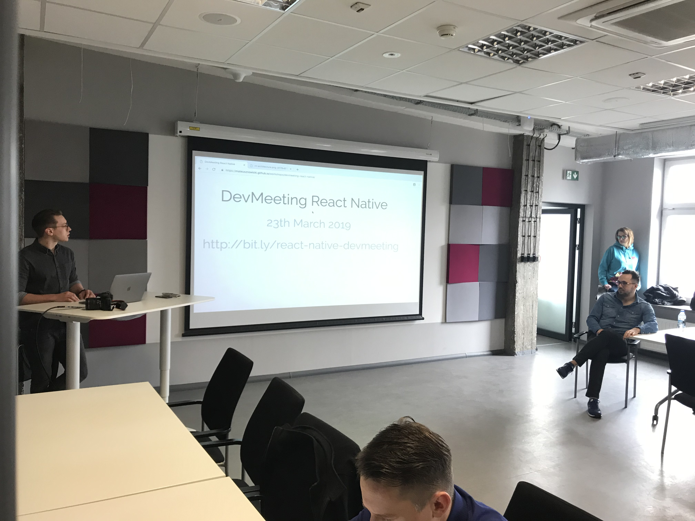

Some time ago I was invited to take part in React Native workshops as a mentor, 
which means I was supposed to help other developers go through tasks and answer their questions. 
The workshops, centered on various topics are called DevMeetings and are run across Poland every couple of weeks. 
Let's take a look at some of the topics we covered there:



#### What They learned 

* Expo

[Expo](https://www.expo.io) is a very convenient tool to use especially if you only have a
couple of hours to present key issues related to a specific topic and 
don’t want to waste that time on configuration. It allows you to go from zero to
running the app on a device in minutes. Also, you don't need a Mac to run an app on iPhone.

* Props, state

The basics of React are all about these two. Props allow you to compose components
by passing data from parents to children:

```jsx{}
import { Text } from "react-native"

const ExampleComponent = ({ text }) => (
  <Text>
    {text}
  </Text>
)
```
And state gives components the ability to control encapsulated data.

```jsx{11}
import React from "react"
import { TextInput } from "react-native"

class ExampleForm extends React.Component {
  constructor(props) {
    super(props);
    this.state = { value: '' };
  }

  handleChange(event) {
    this.setState({value: event.target.value});
  }

  render() {
    return (
       <TextInput 
         type="text" 
         value={this.state.value} 
         onChange={this.handleChange} 
        />
    );
  }
}
```
The `value` state here is neither visible to the parent component nor is it injected as props are. But it's pretty common 
to set an initial state for state based on props:


```jsx{6}
...

class ExampleForm extends React.Component {
  constructor(props) {
    super(props);
    this.state = { value: props.initValue };
  }
  
...
```

As of React Native 0.57.5 where [React Hooks](https://reactjs.org/docs/hooks-intro.html) were introduced you can use state 
within functional components:

```jsx{5}
import React, { useState } from 'react'
import { TextInput } from "react-native"

const ExampleForm = () => {
  const [value, setValue] = useState('')

  handleChange(event) {
    setValue({value: event.target.value})
  }

  render() {
    return (
       <TextInput 
         type="text" 
         value={this.state.value} 
         onChange={this.handleChange} 
        />
    );
  }
}
```

I personally opt for functions over classes to omit the confusion with `this` which is mutated over time by React.


* Forms and AsyncStorage

Forms are the bread and butter of every frontend developer so it makes sense to
present the idiomatic way of writing them in React Native. This was the place
where we used the power of state for the purpose of saving inputs on each
keystroke and then push it to AsyncStorage on form submit.


```jsx{}
  import { AsyncStorage } from 'react-native';

  await AsyncStorage.setItem('form', form);
  ...
  const form = await AsyncStorage.getItem('form');
```

AsyncStorage is not the perfect solution for this case, yet the API is pretty
straight forward and gives a lot of functionality without much boilerplate.

* Navigation through an app

Or as a web developer would call it `routing`. With React-navigation you set up routing almost as you would do it on the web. 
A set of screens that you access via navigation to an established route. 

```jsx{}
import { createStackNavigator } from 'react-navigation';

const Navigator = createStackNavigator({
  List: { screen: List },
  Detail: { screen: Detail },
});

...
```

Paths are optional, which may come as a surprise to web devs 
at the beginning but quickly becomes clear when they notice that we are in the world of mobile apps - though it's possible to operate on paths and it's common to use them when you open an app from the link.
 
#### What I’ve noticed

How many things you can do when you are passionate and curious. Mr obvious
strikes again, I know, but it hammered home to me during the last workshops. The
tasks given to people are mostly far from being mundane and obvious to
participants. It challenges them and gives them additional motivation to build something new.


Also, there are many things I thought I’d known before I was asked to explain
them in detail, like differences between `div` and `Text`, or
intricate details about Expo.

Last but not least, I had the opportunity to do pair programming for a couple of hours, with many developers,
 on many different issues. Yes, it was tiring, but whether you like it or not pair programming is simply an effective way of
solving a couple of software development problems by: 

* Boosting the distribution of knowledge. Diminish the number of bottlenecks in the
organization by encouraging other people to sit together and share their knowledge
and work on solutions.
* Alleviating communication bias. Real time meetings, especially when you see other
people, are way more dynamic and allow you to express more with fewer words. Even
though your wording might not be as specific as if you wrote them down, you have the 
ability to express yourself through gestures and intonation, which can convey emotions.
Doubt, apprehension, excitement or cheer just to name a few. 
* Tightening up the feedback loop. You don’t have to wait until 2 days after you've finished development
to get corrective feedback which then forces you to redesign the solution. And
then you think that the worst thing here is that the new solution is simply
better, if only you'd got it earlier… 

To sum up, the workshops were beneficial for both mentors and mentees. I'm looking forward to the next one!

