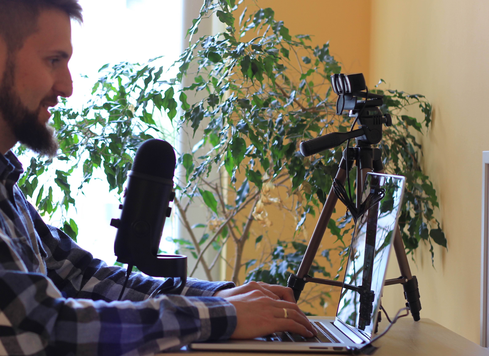
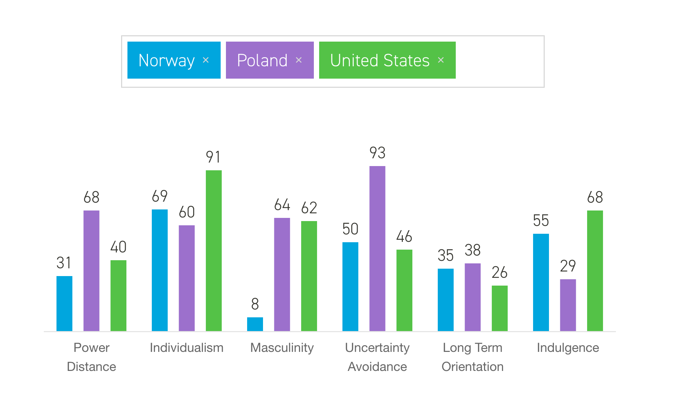
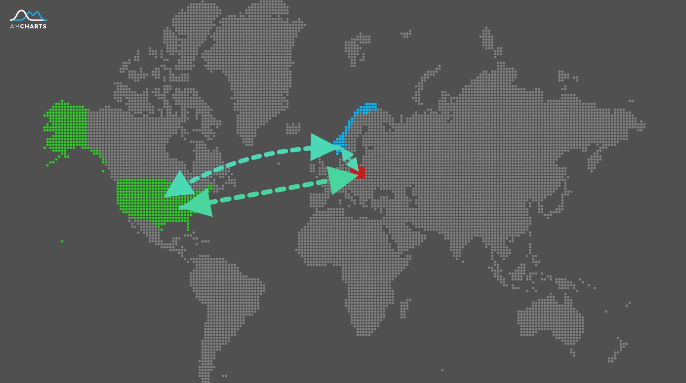

Remote work gains in popularity year by year. It's definitely a global trend that has been enabled by the Internet and allows one to provide one’s expertise to any part of the world. While it definitely gives the possibility to freely exchange resources, it also comes with some obstacles that hinder its implementation:
* time zones
* native languages
* different culture
* various communication biases

I will try to address all the issues.

### Adjust your working time to the office hours

If the time difference is 6h, as in the case of Poland and New York, USA, it is advised to work afternoons (sometimes it’s a condition). You want to be able to work at least 3–4 hours within the other time zone. I recommend using [this tool](https://www.worldtimebuddy.com/) to visualize the difference.

This time is usually used for meetings, demos, code reviews, pair programming, but if you’re in the minority it might happen that the meetings take place in the evening and then you might end up having meetings at around 9pm or so.

### Try to have pair programming sessions as if you were in the office

There are dozens of benefits of programming in pairs (or more)

Plan pair programming sessions ahead of time. It might not be aligned with the engineering culture in some companies though, so don’t panic if somebody looks at you as if you were a weirdo. Be the first one to mention screen sharing and show that you’re open to suggestions. 

You definitely need the right tooling to run an effective session. If you’re using [VS code](https://code.visualstudio.com/) you’ll need the [Live Sharing](https://visualstudio.microsoft.com/services/live-share) plugin. It will simulate one keyboard shared between two or more software developers.

### Set a high standard of communication even if nobody expects it

That’s one of the biggest obstacle to overcome in remote work. Nothing can replace the face to face interaction, but on the other hand engineers usually don’t enjoy working in groups side by side and so it’s not always a bad thing. Anyway, there are a couple of things we can do to address the communication overhead.

1.  Invest in top quality communication tools

Spend $149 and buy a good microphone like [Blue Yeti](https://www.amazon.com/Blue-Yeti-USB-Microphone-Silver/dp/B002VA464S). You will be heard loud and clear, literally and figuratively. 

Spend $125 on a [webcam](https://www.logitech.com/en-us/product/c930e-webcam). 

At this point you have a good setup for being heard and seen.

2. Be on time to meetings

Being late to meetings is disrespectful. You want to be there a couple of minutes before the meeting starts, yet it really depends on the company culture what “on time” means, but before you learn it, it’s better to simply stick to that rule. 

3. Async communication is great, but don’t overestimate it

While most of the communication will be done via asynchronous channels, sometimes it’s worth jumping on a call and discussing an issue without the need to write and read again and again. If you’re worried that you will lose the benefit of having the conversation written down somewhere — no worries, you can record the dialog!

### Encourage the team to record meetings

Especially those where somebody gives instructions or an introduction to a new tool or shares knowledge. Nobody can memorize step by step [instructions like these](https://youtu.be/Xh2nnjttOwo). Sure that they become obsolete with time, but it's better to have them documented anyway.

It would be more beneficial to record them, publish the material within the company and let people get back to it when they are in need. If you work remotely you might be the one who ends up using it first.

### Raise visibility by staying transparent 

On the whole, you should try to use the tooling provided by the team and in most cases it will be comprised of project management platforms, source code repos and communication channels.

In my opinion in most cases you’ll be just fine using what other team members use. Some exceptions depend on how your role is different from most roles in the team.

**If you’re the first remote engineer in the team**, you should think of being proactive in staying visible with what you do. If you get hired as the first remote person ever, you’re definitely an expert and you’re the one who is expected to create an effective means of collaboration.

**If you’re not the first one, but your time zone is very different** from the rest of the team, and you work mostly in your time zone, you must be cautious since the good practices within the team might not be enough in your case. You will mostly communicate in an async fashion, so you should place a lot of importance on setting a high standard to raise visibility. 

Regardless of your situation there is a piece of advice on how to achieve this:
**Divide work into smaller chunks so that you can deliver daily. Describe the job that is done with a descriptive pull/merge request message with video or gifs and by small and self-explanatory commits.**

### We are all different 

It's a business's vested interest to hire the most qualified candidates irrespective of differences. It should go without saying and it indeed does in a great number of IT companies, but some do include the following information to clarify though:    

*We are an equal opportunity employer and value diversity at our company. We do not discriminate on the basis of race, religion, color, national origin, gender, sexual orientation, age, marital status, veteran status, or disability status. We are ADA compliant and handicap accessible.*

Whether it's honest and a company is really committed to these values is anybody's guess, but you should definitely stay fair. 

**This is one of the greatest advantages of a highly competitive market. It supports expertise and doesn't give a damn about your personal traits, which are meaningless from a business perspective.**

### Be aware of the differences in culture

When you work remotely for a company located in a different country it's almost as if you were really there. **You must read up on their customs.** 

[Hofstede Insights](https://www.hofstede-insights.com/product/compare-countries/) has been trying to categorize differences between cultures into groups and connect these groups with countries for a long time now. Even though they compare countries, I believe they should rather focus on comparing cultures themselves. Nevertheless, some conclusions hit home and it's worth checking out. 

[These are all very influential factors](https://www.hofstede-insights.com/models/national-culture/) that may work for you if you handle them wisely, but they can also take you aback if you underestimate their influence. 

#### Let's compare!

Take [Poland, Norway and the United States](https://www.hofstede-insights.com/country-comparison/norway,poland,the-usa/) as an example, and **have some fun comparing them and focusing on Poland**:

*Relatively high Distance to power and quite low Individualism is definitely what I would expect to be clearly visible in the Polish society now. Hell yeah, whether it's the influence of years of occupation, wars and socialism I don't know, but Poles in general are keen to accept authority (as long as it's Polish, heh).*

*We are all men, and high Masculinity expresses this, that is, being result driven rather than having fun at work. Even women are men. They must be in order to survive here. I mean, they must be competitive, we all must be. Nobody will pay you just for being special or different.*

*Uncertainty Avoidance scored almost 100%... "But what is Uncertainty" a Pole may ask you one day. "I haven't met any in my entire life!". Totally, most Poles are satisfied with a stable 9-5 job, spending their entire life in the same place, apartment or house.*

*By and large Poles are long-term oriented and are quite restrained when it comes to allowing for some enjoyment in their lives. Omg they must be boring as hell! (they are)*

Even though I don't fit into the generalized version of a Polish guy, I must agree that I was raised within such a society. I feel, however, that I recognized these traits and intentionally ditched those which I didn't accept

 
 Knowing your own environment is one thing, and it will help you, but there are even more benefits if you are open to other coworkers' cultures and beliefs. You will understand that some of them are just part of their identity and cannot be fought back or altered. Instead, they should be understood and some work towards accepting these differences might do wonders for your relationships.

### To sum up

While very attractive and beneficial, remote work comes with some obstacles. Handle them properly and you will be able to focus only on the benefits and forget about the problems. 

Be mindful of how you communicate, stay visible when it comes to how the job is going and, last but not least, embrace the diversity.

I hope you will be fine with the piece of advice I gave you. I’m constantly learning how to work remotely, both by working remotely within teams and building and running new teams from time to time. If you have any suggestions I would appreciate any feedback. 

Resources:
- [Live Sharing for VS code](https://visualstudio.microsoft.com/services/live-share)
- [Time zone buddy](https://www.worldtimebuddy.com/)
- [Country comparison with regard to culture](https://www.hofstede-insights.com/country-comparison)
- [Webcam I use](https://www.logitech.com/en-us/product/c930e-webcam)
- [Microphone I use](https://www.amazon.com/Blue-Yeti-USB-Microphone-Silver/dp/B002VA464S)