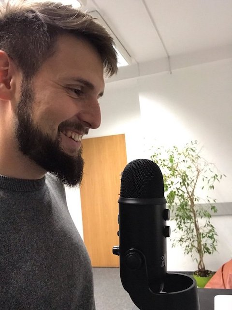

Remote work gains in popularity year by year. It's definitely the global trend that has been enabled by the Internet and allows to provide you expertise to any part of the world. While it definitely gave the possibility to freely exchange resources, it also comes with some obstacles that makes the implementation hard:
* Time zones
* Different native languages
* Different culture
* Variuos communication biases

I will try to address all the issues from the list.

### Adjust your working time to the office hours

If the time difference is 6h, as in the case of Poland and New York, USA, it is advised to work afternoons (sometimes it’s a condition). You want to be able to work at least 3–4 hours within the other time zone. I recommend using [this tool](https://www.worldtimebuddy.com/) to visualize the difference.

Usually it’s time to do meetings, demos, code reviews, pair programming, but if you’re in minority it might happen that the meetings would take place at evenings and then you might end up having meetings at around 9pm or so.

### Try to have pair programming sessions as if you were in the office

There are dozens benefits of programming in pairs (or more)

Plan pair programming session ahead. It might not be align with the engineering culture in some companies though, so don’t panic if somebody looks at you like you were a weirdo. Be the first one how makes screen sharing and show that you’re open to suggestion. 

You definitely need a good tooling to run an effective session. If you’re using [VS code](https://code.visualstudio.com/) you’ll need [Live Sharing](https://visualstudio.microsoft.com/services/live-share) plugin. It will simulate the one keyboard shared between two or more software developers.

### Set high standard of communication even if nobody expects it
(ZDJĘCIA!!!)
That’s one of the biggest obstacle to overcome in remote work. Nothing replaces the face to face interaction, but on the other hand the engineers usually don’t enjoy working in groups side by side and so its not always a bad thing. Anyway, there are a couple of things we can do address the communication overhead.

1.  Invest in top quality communication tools

Spend $149 and buy a good microphone like[ Blue Yeti](https://www.amazon.com/Blue-Yeti-USB-Microphone-Silver/dp/B002VA464S). You will be heard clearly and loudly. 

Spend $125 on a [webcam](https://www.logitech.com/en-us/product/c930e-webcam). 

At this point you have a good setup for being heard and seen.

2. Be on time on meetings

Being late on meetings is disrespecful. You want to be a couple of minutes before a meeting starts, yet it  really depends on the company culture what “on time” means, but before you learn it, it’s better to simply stick to that rule. 

3. Async communication is great, but don’t overestimate it

While most of the communication will be done via asynchronous channels, sometimes it’s worth jumping on a call and discuss an issue without the need to write and read again and again. If you’re worried that you will lose the benefit of having the conversation written down somewhere — no worries you can record the dialog!

### Encourage the team to record meetings

Especially these where somebody gives an intruction or introduction to a new tool or shares knowledge. Nobody can memorize the step by step instruction like this: [https://youtu.be/Xh2nnjttOwo](https://youtu.be/Xh2nnjttOwo)

You would rather record it and publish within the company and let people get back to it when they are in need. If you work remotely you might be the one how will use it first.

### Raise visibility by staying transparent 

On the whole, you should try using the tooling provided by the team and in the most cases it will be comprise with project management platforms, source code repos and communication channels.

In my opinion in most cases you’ll be just fine with using what other team members use. Some exceptions depend on how your role is different from the most roles in the team.

**If you’re the first remote guy in the team**, you should think of being proactive in staying visible with what you do. If you get hired as the first remote guy ever, you’re definitely an expert and you’re the one who is expected to create an effective mean of collaboration.

**If you’re not the first one, but your time zone is very different** from the rest of the team, and you work mostly in your time zone, you must be causious since the good practices within the team might be not enough in your case. You will communicate mostly async, so you should place a lot of importance on setting high standard to raise visibility. 

Regardless of your situation there is a piece of advice on that:
**Divide work to smaller chunks that you can deliver daily. Describe the job that is done by the desciptive pull/merge reguest message with video or gifs and by small and self-explanatory commits.**

### Be aware of the difference in culture

1. Perceiving time https://eprojectconsult.com/monochronic-vs-polychronic/
2. Various factors https://www.hofstede-insights.com/product/compare-countries/

