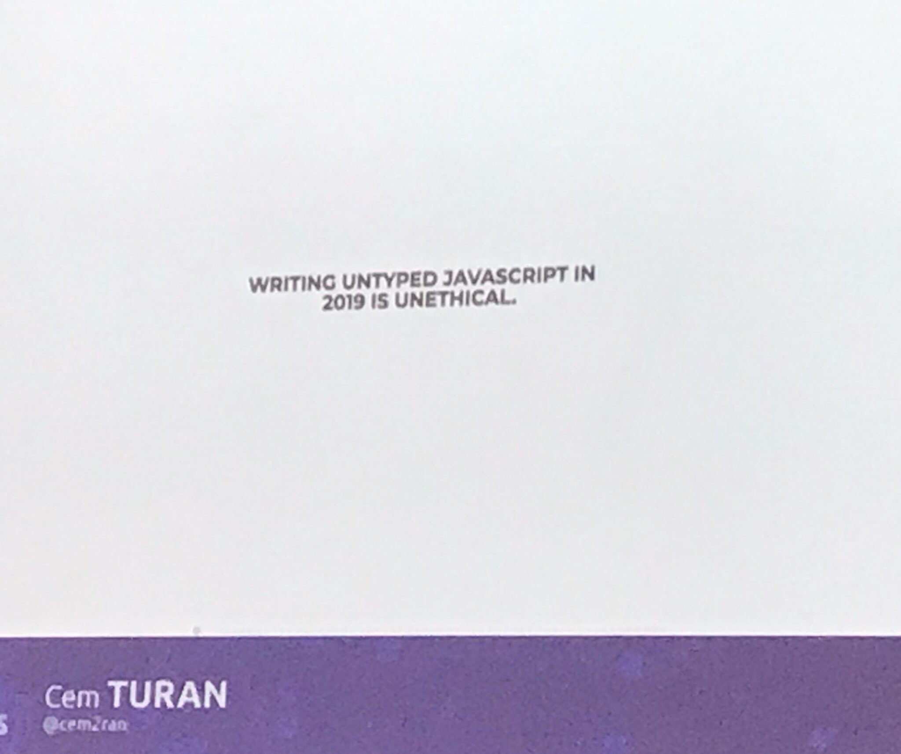
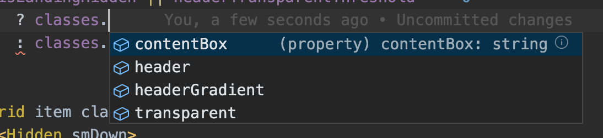
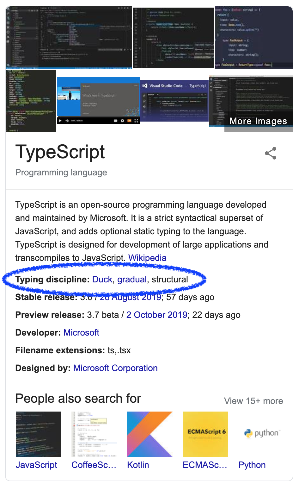

- **[What do you know that makes you think you can actually write and teach about TypeScript?]()**
- **[TypeScript in general. Benefits]()**
- **[Compile time, build time, run time and... author time]()**
- **[Type system - a closer look]()**
- **[Having a good configuration]()**
- **[Caveats]()**
- **[Further reading]()**
- **[Summary]()**

### What do you know that makes you think you can actually write about and teach TypeScript?

I've been working with very different programming languages over the years. From some of them you would expect to receive incredible help from the compiler, from others, well, significantly less help and sometimes you might be thinking the language itself is being obnoxious...

I've been working in the following JavaScript/TypeScript setups:

- TypeScript
- JavaScript with PropTypes
- JavaScript with Flow
- rewriting JavaScript to TypeScript (or I should say "adding types" since JS was already quite similar to TS back then)
- teaching TypeScript to seasoned JS developers

Interestingly, I had first started with TypeScript before I moved to JavaScript. This was actually quite a popular way of entering the JS world for people whose prior experience focused on strongly typed languages such as Java (for Android in my case).

In 2019 I ran [workshops on React and TypeScript](https://okelm.gitbook.io/devmeetings-react-ts-fork/). This was a collaborative effort of [Maciej Kucharski](https://github.com/kucharskimaciej), [Devmeetings](http://devmeetings.org/pl) and me.

A lot of developers want to learn TypeScript, sometimes they don't know why. Well, there are very good reasons to do so.


## TypeScript in general. Benefits

You may find various opinions on the Internet:
> TypeScript is JavaScript with types

> Types are for people who can't read code

> TypeScript is JavaScript for Java developers who need types

> TypeScript together with VS Code are the best tools fromMicrosoft

People also poke fun at JavaScript like this:

https://twitter.com/cszhu/status/1169859162047574016?s=20

JavaScript leaves a lot to be desired, that's the fact. Even with new features coming regularly from the [commitee](https://github.com/tc39) it's really hard to keep up the pace of modern languages. While we cannot have everything, we can try to make the world a better place by being more careful and considering thoroughly the tooling we choose.

I believe that a good developer experience happens when a programming language has these traits:

- concepts can be expressed in a concise manner without too much boilerplate
- the code is unambiguous and expressive
- newcomers are welcomed with self documented code
- the code is focused on data transformation rather than data obfuscation
- a compiler or IDE helps you write quality code

TypeScript is here to help you achieve some of these ^ namely:

- code becomes less ambiguous, thanks to having strictly defined types
- code is more self-documented which helps newcomers to get into the project, but also to come back after some time and still be able to understand what is happening

> The thing that I believe would make software development in JavaScript better is having a strong and static type system.

That's my opinion, I know people are more opinionated about this issue. [Cem Turan](https://twitter.com/cem2ran) expressed his views on the subject in this way at the [App.js conference](https://appjs.co/):



### Compile-time, build-time, runtime but first... author-time

Before a developer takes advantage of compile-time type checking, they will first encounter the pleasant experience of robust autocompletion when writing their code in most modern IDEs. The time spent on writing your programs can be called **author-time**.



So TypeScript helps you even when you write your code, which leads to fewer typos. It also prevents you from checking an object property each time you want to access it, just because you've forgotten.

Next is when your code is compiling and that's when static type checking is happening, it's called **compile-time**, which precedes **build-time** - the time to gather up all the assets and build an app.

Once you deploy your app and start using it after hours/weeks/years of development, you can say it finally runs. That is **runtime**, and that's the final destination of all apps. It's also damn late to reveal all the bugs... But that's how dynamically typed languages like JavaScript work.

### Type system - a closer look

TypeScript has a different approach to typing. The difference lies mainly between **static and dynamic** types.

By and large, it's a subject of discussion which approach is better, but most developers would agree that for some programming languages’ design it's more appropriate to have one approach rather than the other. So, _it depends_. The current trend is to have strong, static types, rather than loose and dynamic ones.

Simply put, static type checking means that types are checked on compile time, not during the execution of the program (which can basically cause the disgraceful/shameful crash). It's simply too late, and every developer’s mind is unreliable from time to time (or most of the time). The information that the program has bugs comes later than it would have if types were checked on a daily basis, or at least in a build pipeline.

>If it's faulty, it's better to discover it quicker.

But TypeScript's type system can be described in more detail than just that. Google tells us this:



- gradual
- duck
- structural

But also:
- partially inferred

#### Gradual

It means that TypeScript allows you to add types to your existing JS codebase step by step. Or it is possible to use types only where you feel like it's appropriate. It's a significant advantage for existing codebases being rewritten to TypeScript.

#### Duck and structural

The JavaScript type system can be described as being **duck typed** which means that the type checking is basically checking if in the particular runtime situation an object has particular properties or behaviors. Like in the example:

```jsx
const gimmeName = somebody => somebody.name
const performWork = somebody => somebody.work()

const person = {
    name: "John", 
    walk: () => console.log("walking"),
}

const employee = {
    name: "Bart", 
    work: () => console.log("working"),
}

gimmeName(employee)
// Bart
gimmeName(person)
// John

performWork(employee)
// working
performWork(person)
// runtime error: undefined is not a function
```

As long as an object has a property a function wants to use, it's an object of the proper type. For _gimmeName_ an object needs to have the _name_ property, and for _performWork_ the function _work_. That's it.

> If it walks like a duck, swims like a duck, and quacks like a duck, then it probably is a duck.

TypeScript allows you to expect the same, but it will verify it at compile-time and this feature of a language is called structural subtyping (which seems to me is the compile-time equivalent of duck types)

```jsx
const gimmeName = (somebody: Person) => console.log(somebody.name)

interface Person {
    name: string, 
}

interface Employee {
    name: string, 
    work: () => void
}

const person: Person = {
    name: "John", 
}

const employee: Employee = {
    name: "Bart", 
    work: () => console.log("working hard")
}

gimmeName(person)
// John
gimmeName(employee) // <-- it doesn't complain 
// Bart

```

The compiler won't complain when _gimmeName_ is invoked with an object of the Employee type. The compiler is just interested in the fact that the _Employee_ has all the fields that _Person_ has (and more! read on ->). _Employee_ might have additional fields (like _work_) but if _Person_ has a field that is missing in _Employee_, compiler will return an error.

```jsx
const gimmeName = (somebody: Person) => console.log(somebody.name)

interface Person {
    name: String, 
    walk: () => void
}

interface Employee {
    name: String, 
    work: () => void
}

const person: Person = {
    name: "John", 
    walk: () => {}
}

const employee: Employee = {
    name: "Bart", 
    work: () => {}
}

gimmeName(employee)
```

>Argument of type 'Employee' is not assignable to parameter of type 'Person'.
>Property 'walk' is missing in type 'Employee' but required in type 'Person'.

That's basically how structural and duck typing work. 
TypeScript has structural typing, because it matches the duck typing of JavaScript.

The alternative to duck types is _nominal typing_ which places more importance on the actual type (it's name), rather than what it represent inside (structure). Two objects are type-compatible only if they are instances of the same type. Even if two types have the same structure, they are just two different types, period.

#### Partial (but enough to be great) type inference

It's not a must to write anytime an object or function is used. It would be tiring and inefficient to say the least.

If you write a type once, the compiler knows the type of the structure and will validate it. However, it has some limitations like (TODO)

### Having a good configuration

The TypeScript compiler is configurable and the style of programming we get in TypeScript depends on that config.

> Two teams with different TS config files can be using TS in a vastly different way.

The config file is usually placed in the top level folder and named _config.ts_.

This is the file I used for one project in 2017 for one of our React Native projects:
```js{10}
{
  "compilerOptions": {
    "target": "es6",
    "module": "es2015",
    "allowJs": true,
    "jsx": "react",
    "sourceMap": true,
    "outDir": "./build",
    "strict": true,
    "noImplicitAny": true,
    "strictFunctionTypes": false,
    "strictNullChecks": true,
    "noImplicitThis": true,
    "alwaysStrict": true,
    "noUnusedLocals": true,
    "noUnusedParameters": true,
    "noImplicitReturns": true,
    "noFallthroughCasesInSwitch": true,
    "moduleResolution": "node",
    "allowSyntheticDefaultImports": true,
    "preserveConstEnums": true,
    "pretty": true,
    "skipLibCheck": true
  },
  "include": [
    "./src/",
    "./types/"
  ],
  "compileOnSave": false
}
```

From all the noise (but some of these may well come in handy one day) these are the ones that make your TypeScript code safe:

```js
strict - Enable all strict type-checking options.
alwaysStrict - Parse in strict mode and emit "use strict" for each source file.
strictNullChecks - Enable strict null checks.
noImplicitAny - Raise error on expressions and declarations with an implied 'any' type
noImplicitThis - Raise error on 'this' expressions with an implied 'any' type.
noUnusedLocals - Report errors on unused locals.
noUnusedParameters - Report errors on unused parameters.
noImplicitReturns - Report error when not all code paths in function return a value.
noFallthroughCasesInSwitch - Report errors for fallthrough cases in switch statement.
```

>If you start a new project you want to have all the flags set to true

> If you are to add TypeScript to an existing project you should consider setting some of them to false at the beginning

### Caveats
Some people complain that:
- More code to write

True, you need to write types here and there. But overall you will spend less time debugging in runtime.

- Errors can be hard to understand
They can be hard to understand. All in all, TypeScript can be described like this:

https://twitter.com/markdalgleish/status/1175868526944387073

- No type inference for function parameters
There are languages in which type inference is more robust than in TS

- _Any_ is a proper type that one can use and basically get rid of static type checking
I literally saw projects where a tech lead who didn't want to learn static typing allowed himself and others to use any anytime they wanted to.

- A lot of configuration options may lead to loose TypeScript configuration which disables static type checking.
Again, it is tempting to lower quality in favor of quick wins. This is like lowering the test coverage threshold, it's very unlikely it will help in the long-term perspective.

### Further reading

- [Our workshops](https://okelm.gitbook.io/devmeetings-react-ts-fork/)
- Open source libs documentation
- [TS docs](https://www.typescriptlang.org/docs/home.html) 
- [This book](https://github.com/basarat/typescript-book) 

Things we've not talked about here but are important:
- basics
- genertics
- alternatives to TS
- adding static type checking to your pipeline
- when not to use TS at all

### Summary

TypeScript wants to become friends with you, it lets you write better JavaScript code. Better in the sense that it will be easier to maintain, onboard newcomers, find bugs quicker. In a nutshell, you'll become more productive.

It comes with a price. First you need to set things up, learn the basics, tackle errors... Sometimes the first thing to do is to persuade your teammates or leadership that this is a price worth paying.

Paraphrasing [a popular saying](https://www.phrasemix.com/phrases/you-have-to-spend-money-to-make-money):
>You have to spend time to make time.